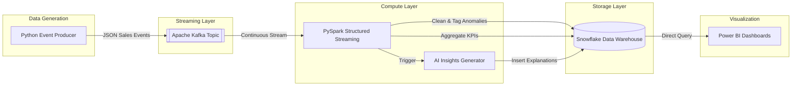

<div align="center">


[](https://git.io/typing-svg)

**An end-to-end streaming data platform that ingests live transactions, detects anomalies, and generates AI-powered business insights.**


</div>

---

## 🚀 Why This Pipeline?

Batch processing dashboards often miss fast-moving anomalies and require stakeholders to decipher what needs attention. This platform solves that by ingesting events **in real-time**, parsing and validating them instantly, and automatically converting anomalies into plain-English **AI risk scores and recommendations**.

Read the full business case in [PROJECT_SHOWCASE.md](PROJECT_SHOWCASE.md).

---

## ✨ System Highlights

| 🔄 Streaming Ingestion | ⚡ Real-Time Processing | 🧠 AI Insights & BI |
|:---|:---|:---|
| 📡 Kafka Event Producer (simulating live POS) | 💧 PySpark Structured Streaming | 📊 Power BI executive dashboards |
| 🚢 Dockerized local Kafka & Zookeeper stack | ✅ Validation & anomaly tagging | 🤖 AI layer generates plain-English risk scores |
| 🛡️ Fault-tolerant stream consumption | ❄️ Snowflake curated fact & aggregate tables | 📉 Actionable next steps for stakeholders |

---

## 🏗️ Architecture Flow



---

## 🛠️ Quick Start Guide

<details>
<summary><b>1. Environment Setup</b></summary>

You'll need Docker Desktop, Python 3.10+, and an active Snowflake account.

```bash
git clone https://github.com/maniktomar/real-time-sales-analytics-AI-pipeline.git
cd real-time-sales-analytics-AI-pipeline
python -m venv .venv
# Activate virtual environment
source .venv/bin/activate  # Mac/Linux
.\.venv\Scripts\Activate.ps1 # Windows

pip install -r requirements.txt
cp .env.example .env
```
*Fill out your Snowflake credentials inside the `.env` file.*
</details>

<details>
<summary><b>2. Start the Kafka Stack</b></summary>

Spin up local Kafka and Zookeeper containers:
```bash
docker compose -f docker/docker-compose.yml up -d
```
</details>

<details>
<summary><b>3. Run the Streaming Pipeline</b></summary>

You need to run these components in separate terminal windows (with your virtual environment activated in each):

**Terminal 1: Start PySpark Consumer**
```bash
python scripts/run_consumer.py
```

**Terminal 2: Start Event Producer**
```bash
python scripts/run_producer.py
```

**Terminal 3: Start AI Insights Generator**
```bash
python scripts/run_ai_layer.py
```
</details>

<details>
<summary><b>4. View the Dashboards</b></summary>

1. Open the `dashboards/Sales_Analytics.pbix` file in Power BI Desktop.
2. Update the Snowflake connection settings to point to your warehouse.
3. Refresh the data to see live KPIs, trends, and AI anomaly explanations!
</details>

---

## 💼 Resume Highlights

- **Real-time streaming design:** Engineered an end-to-end journey from event generation to BI dashboard using Kafka and PySpark Structured Streaming.
- **Modern Data Stack:** Designed a Snowflake schema with fact, error, aggregate, and AI insight tables for optimized Power BI reporting.
- **AI-Assisted Recommendations:** Integrated an insights layer that transforms raw streaming anomalies into actionable business intelligence for non-technical stakeholders.

<div align="center">
  <i>Built by Manik Tomar</i>
</div>
