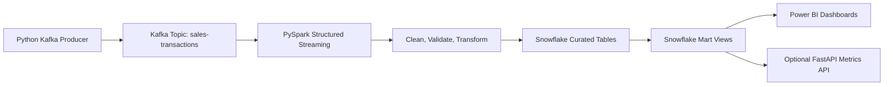

# Real-Time Sales Analytics Pipeline

End-to-end portfolio project for streaming sales analytics with Kafka, PySpark Structured Streaming, Databricks, Snowflake, Power BI, Python, Docker, and GitHub Actions.

Resume line:

> Developed a scalable real-time data pipeline using Kafka, PySpark, Databricks, Snowflake, and Power BI for streaming analytics, automated data transformation, and real-time KPI monitoring.

## Architecture



Detailed architecture notes live in [docs/architecture.md](docs/architecture.md).

For a portfolio-oriented overview, see [PROJECT_SHOWCASE.md](PROJECT_SHOWCASE.md). For a step-by-step interview demo, see [docs/demo_guide.md](docs/demo_guide.md).

## Folder Structure

```text
.
├── api/                  # Optional FastAPI endpoint for live metrics
├── configs/              # Environment-driven YAML config
├── consumer/             # Debug Kafka consumer
├── dashboards/           # Power BI dashboard design guidance
├── data/                 # Sample JSONL sales events
├── databricks/           # Databricks notebook export
├── docker/               # Kafka, Zookeeper, and Kafka UI
├── docs/                 # Architecture and monitoring docs
├── logs/                 # Runtime logs
├── producer/             # Kafka event generator and producer
├── pyspark_jobs/         # Structured Streaming pipeline modules
├── snowflake/            # Database, tables, and mart views
├── tests/                # Lightweight unit tests
├── requirements.txt
└── README.md
```

## What Each Module Does

- `producer/event_generator.py`: creates realistic transaction events with optional anomalies.
- `producer/kafka_producer.py`: publishes generated events to Kafka with idempotent delivery and retry handling.
- `consumer/kafka_debug_consumer.py`: reads Kafka messages for local smoke testing.
- `pyspark_jobs/schemas.py`: defines the strict streaming event schema.
- `pyspark_jobs/transformations.py`: cleans, validates, flags anomalies, and creates one-minute aggregates.
- `pyspark_jobs/streaming_sales_pipeline.py`: reads Kafka and writes either console output or Snowflake tables.
- `databricks/01_streaming_sales_pipeline.py`: notebook-style version for Databricks clusters.
- `snowflake/*.sql`: creates schemas, curated tables, and BI-friendly views.
- `dashboards/powerbi_dashboard_guide.md`: lays out Power BI report pages and visuals.
- `api/metrics_api.py`: exposes Snowflake KPI data over REST.
- `ai_insights/anomaly_insights.py`: generates AI-style anomaly explanations, risk scores, and recommended actions.

## Prerequisites

- Python 3.11
- Docker Desktop
- Java 8, 11, or 17 for local Spark
- Git
- Snowflake account for warehouse storage
- Power BI Desktop for dashboarding
- Databricks workspace for managed streaming execution

## Setup

### 1. Create a virtual environment

Windows PowerShell:

```powershell
python -m venv .venv
.\.venv\Scripts\Activate.ps1
python -m pip install --upgrade pip
pip install -r requirements.txt
Copy-Item .env.example .env
```

Mac or Linux:

```bash
python3 -m venv .venv
source .venv/bin/activate
python -m pip install --upgrade pip
pip install -r requirements.txt
cp .env.example .env
```

Edit `.env` with your Kafka and Snowflake values.

### 2. Start Kafka locally

```bash
docker compose -f docker/docker-compose.yml up -d
```

Kafka runs at `localhost:9092`. Kafka UI runs at `http://localhost:8080`.

### 3. Run the Kafka producer

```bash
python -m producer.kafka_producer
```

In another terminal, inspect events:

```bash
python -m consumer.kafka_debug_consumer
```

### 4. Run the local Spark pipeline to console

For a local console demo:

```bash
spark-submit ^
  --packages org.apache.spark:spark-sql-kafka-0-10_2.12:3.5.3 ^
  pyspark_jobs/streaming_sales_pipeline.py --sink console
```

Mac or Linux:

```bash
spark-submit \
  --packages org.apache.spark:spark-sql-kafka-0-10_2.12:3.5.3 \
  pyspark_jobs/streaming_sales_pipeline.py --sink console
```

### 5. Create Snowflake objects

Run these scripts in Snowflake:

```sql
-- 1
snowflake/01_create_database_schema.sql

-- 2
snowflake/02_curated_tables.sql

-- 3
snowflake/03_views_for_powerbi.sql
```

### 6. Run the Spark pipeline to Snowflake

Install or attach the Snowflake Spark connector when running Spark. Example:

```bash
spark-submit \
  --packages org.apache.spark:spark-sql-kafka-0-10_2.12:3.5.3,net.snowflake:spark-snowflake_2.12:2.16.0-spark_3.4,net.snowflake:snowflake-jdbc:3.16.1 \
  pyspark_jobs/streaming_sales_pipeline.py --sink snowflake
```

For Databricks, import [databricks/01_streaming_sales_pipeline.py](databricks/01_streaming_sales_pipeline.py), configure secrets under a `snowflake` scope, and attach the Kafka and Snowflake connector libraries to the cluster.

### 7. Connect Power BI

Use `Get Data > Snowflake`, then select:

- `MARTS.VW_REALTIME_KPIS`
- `MARTS.VW_SALES_TRENDS`
- `MARTS.VW_ANOMALY_EVENTS`

Dashboard design guidance is in [dashboards/powerbi_dashboard_guide.md](dashboards/powerbi_dashboard_guide.md).

### 8. Optional metrics API

```bash
uvicorn api.metrics_api:app --reload --host 0.0.0.0 --port 8000
```

Open `http://localhost:8000/health` or `http://localhost:8000/metrics/realtime`.

## Data Quality and Anomaly Rules

The Spark job flags:

- Non-positive quantities.
- Very high quantities.
- Very high order values.
- Order amount mismatches.
- Invalid records that fail quality checks.

Valid events go to `CURATED.FACT_SALES_EVENTS`. Invalid events go to `CURATED.ERROR_SALES_EVENTS`. One-minute metrics go to `CURATED.AGG_SALES_METRICS_1M`.

## Testing

```bash
pytest -q
```

GitHub Actions runs the same tests using [.github/workflows/ci.yml](.github/workflows/ci.yml).

## Helper Scripts

Windows PowerShell scripts are available in `scripts/`:

```powershell
.\scripts\start_kafka.ps1
.\scripts\run_producer.ps1
.\scripts\run_spark_console.ps1
.\scripts\run_spark_snowflake.ps1
.\scripts\run_ai_insights.ps1
.\scripts\stop_kafka.ps1
```

## Production Hardening Ideas

- Use Schema Registry for event contracts.
- Add dead-letter Kafka topics for malformed payloads.
- Store Spark checkpoints in cloud object storage.
- Use Snowflake streams/tasks or dynamic tables for downstream marts.
- Add Great Expectations or Deequ for formal data quality checks.
- Add Terraform for Snowflake, Databricks, and cloud infrastructure.
- Add Power BI deployment pipeline documentation.

## Optional AI Insights

After loading anomaly events into Snowflake, run:

```bash
python -m ai_insights.anomaly_insights --limit 100
```

This writes plain-English anomaly explanations to `CURATED.AI_ANOMALY_INSIGHTS` and exposes them through `MARTS.VW_AI_ANOMALY_INSIGHTS`.

See [docs/ai_insights.md](docs/ai_insights.md).
