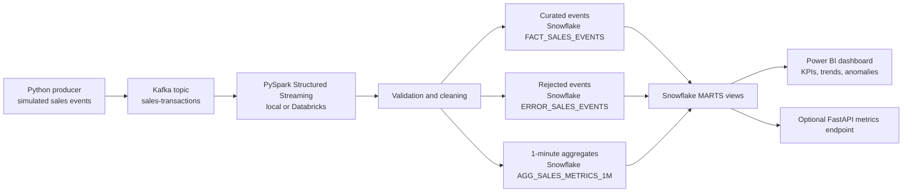

# Architecture

## Data Flow

1. The producer emits JSON sales transactions to Kafka.
2. Spark reads Kafka in micro-batches, parses the JSON payload, and applies quality checks.
3. Valid events, invalid events, and aggregate metrics are written to Snowflake through `foreachBatch`.
4. Power BI connects to Snowflake mart views for operational reporting.

## Operational Notes

- Kafka partitions can be increased as event volume grows.
- Spark checkpoint locations must be durable in production, for example DBFS or cloud object storage.
- Snowflake warehouses should use auto-suspend and separate ingestion/reporting workloads for cost control.

